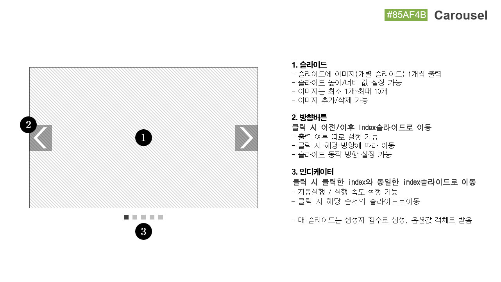
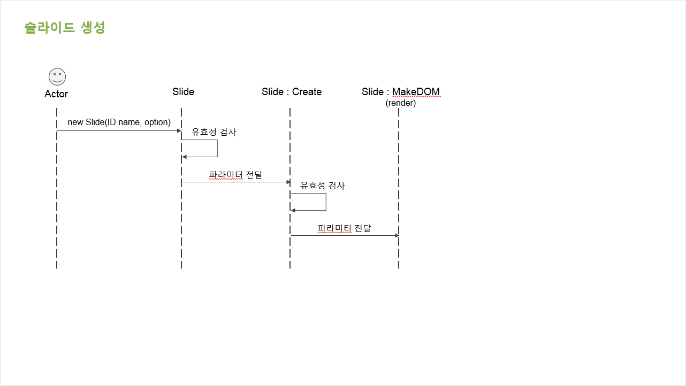
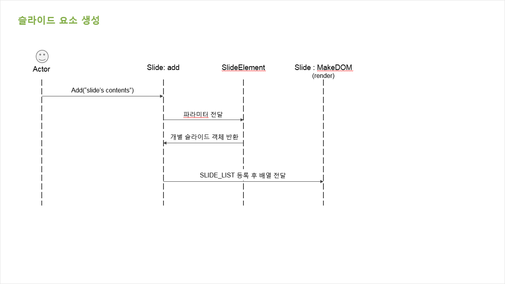
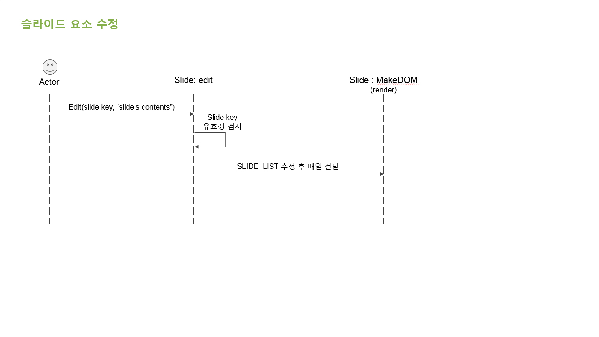

# [#85AF4B] Carousel

## Project 요구사항


### 슬라이드
  1. 슬라이드에 이미지 1개씩 출력
    - 소요시간 : 30분
    - 완료조건
      ```
      슬라이드는 한번에 하나의 이미지만 출력한다
      ```
  2. 슬라이드 width, height 설정
    - 소요시간 : 1시간
    - 완료조건 : 
      ```
      옵션 값으로 슬라이드의 높이와 너비를 받아 설정할 수 있다
      ```

### 이미지
  1. 이미지는 1~10개 표시 가능
    - 소요시간 : 1시간
    - 완료조건 
      ```
      슬라이드의 이미지는 최소 1개, 최대 10개까지 등록 가능하다
      ```
  2. 이미지는 추가, 삭제가 가능
    - 소요시간 : 2시간
    - 완료조건 :
      ```
      슬라이드의 이미지를 등록/삭제할 수 있다
      ```

### 방향 버튼
  1. 출력 여부 설정 가능
    - 소요시간 : 1시간
    - 완료조건 
      ```
      옵션 값으로 방향 버튼 출력 여부를 받아와 출력한다
      ```
  2. 각 화살표 클릭 시, 이전/이후 슬라이드로 이동
    - 소요시간 : 3시간
    - 완료조건 
      ```
      각 방향 버튼 클릭 시, 출력 슬라이드 이미지의 이전/이후의 이미지를 출력한다
      ```
  3. 슬라이드 동작 방향(left, right, 둘다) 설정 가능
    - 소요시간 : 1시간
    - 완료조건
      ```
      옵션 값으로 슬라이드 동작 방향을 설정할 수 있으며(기본값은 양방향),
      이에 따라 방향 버튼을 출력하고, 슬라이드가 이동한다
      ```
  4. 화살표는 슬라이드 내 위치하여 opacity 값 조정
    - 소요시간 : 30분
    - 완료조건 
      ```
      화살표는 슬라이드 내에 위치하여 투명도로 hover 효과를 갖는다
      ```

### 인디케이터
  1. 출력 여부 설정 가능
    - 소요시간 : 1시간
    - 완료조건 
      ```
      옵션 값으로 인디케이터 출력 여부를 받아와 출력한다
      ```
  2. 인디케이터를 클릭하면 해당 이미지 슬라이드로 이동
    - 소요시간 : 1시간
    - 완료조건 
      ```
      클릭한 인디케이터의 순서에 맞는 이미지 슬라이드로 이동
      ```
  3. 현 이미지에 index에 맞게 active 효과
    - 소요시간 : 30분
    - 완료조건 
      ``` 
      현재 출력된 이미지 슬라이드 순서에 맞는 인디케이터에 active 효과
      ```

### 실행
  1. auto play 설정(자동으로 실행, ms로 시간 설정)
    - 소요시간 : 2시간
    - 완료조건 
      ```
      옵션 값으로 자동실행 여부, 이동 속도를 받아와 실행
      ```
  2. 매 슬라이드는 생성자 함수로 생성, 각 옵션값을 객체로 넘겨 기본값(default)과 병합
    - 소요시간 : 1시간
    - 완료조건 
      ```
      슬라이드 생성 시, 생성자 함수 활용하여 옵션 값을 객체로 넘겨 설정한다
      ```

- - -
## 화면정의서


- - -
## 시퀀스 다이어그램





- - -

## 마일스톤

### 1주차
### 2주차
