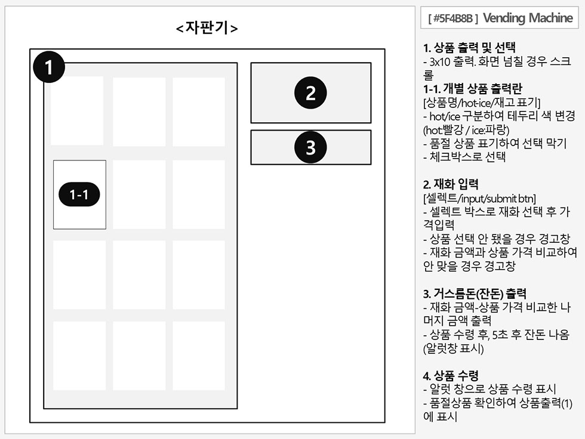

# [#5F4B8B] Vending Machine
## Project 요구사항

### 1 - 상품
재고 확인, 표시, 등록 등등 모두 자판기에서 사용되는 기능이지만 상품과 관련 된 상품의 카테고리로 묶어 정리

#### 상품 등록
1. 상품명, 가격, 재고량의 데이터를 가짐
   - 소요시간 : -
   - 완료조건
      ```
      상품 재고 데이터베이스 마련(javascript 배열 혹은 map으로 작업 예정)
      [idx / 상품명 / 가격 / hot-ice / 재고량 / 출력여부]
      ```
2. 상품을 채우기 전에는 상품이 등록되어 있어야 함
   - 소요시간 : 2시간
   - 완료조건
      ```
      상품 개수에는 제한이 없으나, 출력 상품의 경우 최대 30개 등록 가능
      기존 등록된 상품명과 동일한 상품은 등록할 수 없으며,
      상품명과 가격, hot-ice, 출력여부 등 각 요소들은 수정 가능
      ```
3. 상품을 빼면 등록 된 상품 정보 또한 없어짐
   - 소요시간 : 2시간
   - 완료조건
      ```
      관리자가 상품 빼어 상품의 재고량이 0일 때 상품 정보 삭제
      사용자 결제로 재고량이 0될 경우, 삭제x
      판매량 데이터베이스에 등록
      ```

#### 상품 채우기
1. 재고를 확인 할 수 있어야 함
   - 소요시간 : 30분
   - 완료조건
      ```
      상품 별 재고량 확인 가능
      ```
2. 재고를 더 채울 수 있음
   - 소요시간 : 1시간
   - 완료조건
      ```
      등록된 상품에 한하여 재고 추가 가능
      판매량 데이터베이스에 등록
      ```
3. 재고의 MAX 값은 30을 넘기지 않음
   - 소요시간 : 30분
   - 완료조건
      ```
      최대값 넘길 경우 재고 추가 불가
      ```

#### 상품 빼기
1. 재고와는 상관없이 상품을 뺄 수 있음
   - 소요시간 : 30분
   - 완료조건
      ```
      관리자는 재고량에 제한 없이 상품 뺄 수 있으며, 이때 재고량 0이 될 경우 상품 정보 삭제
      판매량 데이터베이스에 등록
      ```

#### 재고 확인
1. 상품 채우기 혹은 빼기, 결제 시마다 재고를 확인하여 작업을 진행해야 함
   - 소요시간 : 1시간
   - 완료조건
      ```
      재고량 변동 시마다 상품 재고량 수정(+/-). 재고 없을 경우 재고 표시만 반환
      (최대값 30넘을 경우 재고 추가 불가 / 재고량 0일 경우 결제 불가 / 관리자가 상품 모두 뺄 경우 상품 정보 삭제)
      ```

#### 재고 표시
1. 상품의 변동사항에 따라 재고가 얼마인지에 대한 값을 반환
   - 소요시간 : 30분
   - 완료조건
      ```
      재고량 변동 시마다 해당 상품 재고량 반환
      ```


### 2 - 자판기
#### 상품 진열 공간
1. 3 X 10 사이즈의 상품을 팔 수 있는 공간을 가짐
   - 소요시간 : 30분
   - 완료조건
      ```
      등록순으로 출력여부에 체크된 상품 30개 출력
      (고려중 - 출력 순서 선택 : 등록순/재고량순..)
      ```
2. 각각의 진열대에는 상품을 등록 혹은 뺄 수 있음
   - 소요시간 : 30분
   - 완료조건
      ```
      등록된 상품 중 출력 여부 수정하여 진열대 출력 선택
      ```
3. 각각의 상품은 `ice` or `hot` 값을 가짐
   - 소요시간 : 30분
   - 완료조건
      ```
      상품 등록 시 적용된 값에 따라 진열대에 표시됨
      (default 값은 ice로 등록되나, 상품 등록 시 선택 가능)
      ```

#### 자판기의 상태
1. 현재 상품의 판매가 가능한지 여부를 반환
   - 소요시간 : 1시간
   - 완료조건
      ```
      출력여부에 체크된 상품 한정, 재고랑 0일 경우 품절 상태 표기
      ```

#### 재화를 입력
1. 동전, 지폐를 입력 받음
   - 소요시간 : 1시간
   - 완료조건
       ```
       해당 재화의 종류와 금액 파악
       ```

#### 상품 선택 버튼
1. 입력받은 재화가 상품의 가치보다 적을 때는 판매하지 못함
   - 소요시간 : 1시간
   - 완료조건
      ```
      품절 상품일 경우 버튼 비활성화
      입력받은 재화 금액과 상품의 가격 비교
      - 재화 금액 > 상품 가격일 경우 진행, 재화 금액 < 상품 가격일 경우 진행 거부 표기
      ```

#### 결제
1. 상품 선택 버튼이 눌려지면 상품 1개 값을 차감
   - 소요시간 : 1시간
   - 완료조건
      ```
      선택 상품의 재고량 1 차감
      판매량 데이터베이스에 등록
      ```
2. 상품 1개를 반환
   - 소요시간 : 30분
   - 완료조건
      ```
      상품 반환
      ```

#### 잔돈 반환
1. 상품이 결제가 끝나면 5초 후 남은 재화를 반환
   - 소요시간 : 1시간
   - 완료조건
      ```
      남은 재화 파악하여 상품 반환 5초 후 사용자에게 반환
      ```
2. 결제 후 5초 전에 다른 상품을 결제를 하면 다시 5초로 리셋
   - 소요시간 : 1시간
   - 완료조건
      ```
      5초 이전 상품 선택 버튼 입력 시, 결제 프로세스로 복귀
      재화 반환 프로세스 무효화
      ```

#### 판매량 체크
1. 하루 동안 어떤 상품이 얼마나 팔렸는지 기록
   - 소요시간 : 2시간
   - 완료조건
      ```
      통계위한 데이터베이스 마련
      - [idx / 상품명(혹은 상품idx) / 판매 및 재고빼간 수량 / 판매 or 관리 / 일자]
      관리자가 상품 추가, 차감 시 + 사용자 상품 결제 시 데이터베이스에 등록
      ```
2. 하루 총 매출 기록
   - 소요시간 : 1시간
   - 완료조건
      ```
      해당 날짜에 판매된 총 매출 합산
      ```
3. 상품 별 매출을 기록
   - 소요시간 : 1시간
   - 완료조건
      ```
      해당 날짜에 판매된 상품별 매출 합산 후 출력
      ```
- - -

## 화면정의서




- - -
## 마일스톤
### 1주차
**상품**
 - [상품 등록] 1. 상품명, 가격, 재고량의 데이터를 가짐
 - [상품 등록] 2. 상품을 채우기 전에는 상품이 등록되어 있어야 함
 - [상품 등록] 3. 상품을 빼면 등록 된 상품 정보 또한 없어짐

 - [상품 채우기] 1. 재고를 확인 할 수 있어야 함
 - [상품 채우기] 2. 재고를 더 채울 수 있음
 - [상품 채우기] 3. 재고의 MAX 값은 30을 넘기지 않음

 - [상품 빼기] 1. 재고와는 상관없이 상품을 뺄 수 있음
 - [재고 확인] 1. 상품 채우기 혹은 빼기, 결제시마다 재고를 확인하여 작업을 진행해야 함
 - [재고 표시] 1. 상품의 변동사항에 따라 재고가 얼마인지에 대한 값을 반환

**자판기**
 - [판매량 체크] 1. 하루 동안 어떤 상품이 얼마나 팔렸는지 기록


### 2주차
**자판기**
 - [상품 진열 공간] 1. 3 X 10 사이즈의 상품을 팔 수 있는 공간을 가짐
 - [상품 진열 공간] 2. 각각의 진열대에는 상품을 등록 혹은 뺄 수 있음
 - [상품 진열 공간] 3. 각각의 상품은 `ice` or `hot` 값을 가짐

 - [자판기의 상태] 1. 현재 상품의 판매가 가능한지 여부를 반환

 - [재화를 입력] 1. 동전, 지폐를 입력 받음

 - [상품 선택 버튼] 1. 입력받은 재화가 상품의 가치보다 적을 때는 판매하지 못함

 - [결제] 1. 상품 선택 버튼이 눌려지면 상품 1개 값을 차감
 - [결제] 2. 상품 1개를 반환

 - [잔돈 반환] 1. 상품이 결제가 끝나면 5초 후 남은 재화를 반환
 - [잔돈 반환] 2. 결제 후 5초 전에 다른 상품을 결제를 하면 다시 5초로 리셋

 - [판매량 체크] 2. 하루 총 매출 기록
 - [판매량 체크] 3. 상품 별 매출을 기록


- - -
## 1주차 스케줄

**월요일(4/2)**
- 스터디
- 프로젝트 주제 및 요구사항 정리

**화요일(4/3)**
- 요구사항 / 피처 별 완료 조건 및 일정정리

**수요일(4/4)**
- [상품 등록] 1. 상품명, 가격, 재고량의 데이터를 가짐
- [상품 등록] 2. 상품을 채우기 전에는 상품이 등록되어 있어야 함


**목요일(4/5)**
- [상품 등록] 3. 상품을 빼면 등록 된 상품 정보 또한 없어짐
- [상품 채우기] 1. 재고를 확인 할 수 있어야 함

**금요일(4/5)**
- [상품 채우기] 2. 재고를 더 채울 수 있음

**토요일(4/7)**
- [판매량 체크] 1. 하루 동안 어떤 상품이 얼마나 팔렸는지 기록
- [상품 채우기] 3. 재고의 MAX 값은 30을 넘기지 않음
- [상품 빼기] 1. 재고와는 상관없이 상품을 뺄 수 있음

**일요일(4/8)**
- [재고 확인] 1. 상품 채우기 혹은 빼기, 결제시마다 재고를 확인하여 작업을 진행해야 함
- [재고 표시] 1. 상품의 변동사항에 따라 재고가 얼마인지에 대한 값을 반환
