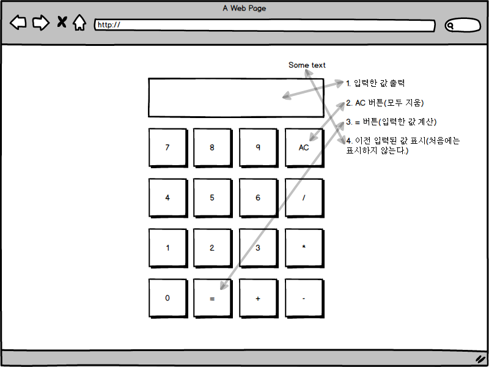
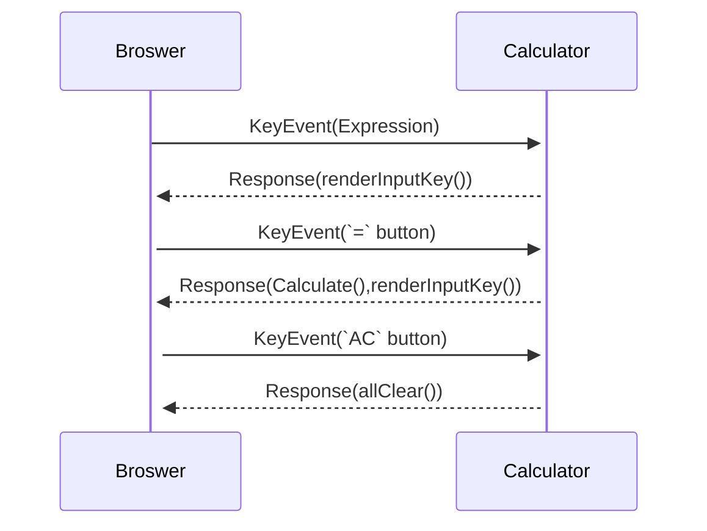

# [#C5D5CB]Carousel 요구사항 정리

## 요구사항

### 연산

1.  기본 연산 가능
    * [완료조건]
      * `+, -, *, ÷` 기본적인 연산 동작
    * [예상소요시간]
      * 3 시간
2.  연산 우선 순위 반영
    * [완료조건]
      * 연산 순위 1 순위 `*,÷` 2 순위 `+,-` (같은 순위 순서는 상관 없음 왼쪽에서 오른쪽 순서로)
    * [예상소요소간]
      * 3 시간
3.  연산 조건
    * [완료조건]
      <!-- * 나눗셈(/)는 정수만 취급 ??? -->
      * 길이는 제한 없음
    * [예상소요소간]
      * 1 시간

### UI

1.  버튼 구성 하기
    * [완료조건]
      * 0~9 숫자, 연산 기호, AC 버튼들 표시
    * [예상소요시간]
      * 1 시간
2.  입력된 내용을 표시
    * [완료조건]
      * 입력된 내용을 상단 UI 에 표시
        * `2 * 4 * 8`을 `2`, `2*`, `2*4` 입력된 순서대로 표시
    * [예상소요소간]
      * 1 시간
3.  AC(All Clear)버튼 클릭 시 입력된 값 삭제
    * [완료조건]
      * AC 버튼 클릭 시 입력된 값은 `0`으로 표시
    * [예상소요소간]
      * 1 시간
4.  `KeyEvent` 추가
    * [완료조건]
      * 마우스뿐만 아니라 키보드로 계산기 동작하기
    * [예상소요소간]
      * 2 시간
5.  커서는 숫자 인풋창에 포커스
    * [완료조건]
      * 계산기 시작 시 인풋창에 포커스하기
    * [예상소요소간]
      * 2 시간

### 참고

1.  구글 계산기 참고
2.  UI 구현 후 연산 기능 구현하기
3.  `eval()` 사용 금지

## 화면정의서

## 시퀀스

<!-- `` -->

## 마일스톤

* 1 주차

  * [UI] 버튼 구성 하기
  * [UI] 입력된 내용을 표시
  * [UI] AC(All Clear)버튼 클릭 시 입력된 값 삭제
  * [UI] `KeyEvent` 추가
  * [UI] 커서는 숫자 인풋창에 포커스

- 2 주차

  * [연산] 기본 연산 가능
  * [연산] 연산 우선 순위 반영
  * [연산] 연산 조건
