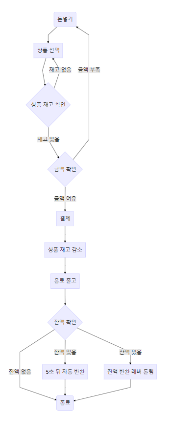

# Project[#5F4B8B] 요구사항 정리

- 재고 확인

	1. 상품 채우기 혹은 빼기, 결제시마다 재고를 확인하여 작업을 진행해야 함
		- **[issue]	- [duckhee][#5F4B8B] - 재고 확인] 상품 재고 변경될 시 재고량 갱신**
		- [기능]
			- 상품 재고 변경시 재고량이 수정된다.
		- [완료조건]
			- 상품이 추가, 빼기, 결제시마다 재고 변경 확인
		- [예상소요시간]
			- 2시간

- 재고 표시

	1. 상품의 변동사항에 따라 재고가 얼마인지에 대한 값을 반환
		- **[issue]	- [duckhee][#5F4B8B] - 재고 표시] 상품 재고량 반환**
		- [기능]
			- 상품 재고량 확인 하기
		- [완료조건]
			- 상품 재고량 화면에 보여준다.
		- [예상소요시간]
			- 2시간

- 상품 등록

	1. 상품명, 가격, 재고량의 데이터를 가짐
		- **[issue]	- [duckhee][#5F4B8B] - 상품 등록] 상품명, 가격, 재고량 상품 등록**
		- [기능]
			- 필요한 속성들을 가진 상품을 생성해 등록
		- [완료조건]
			- 상품명, 가격, 재고량, 판매재고량, 판매가능유무 속성을 가진 상품 등록
			- 등록된 상품 확인
		- [예상소요시간]
			- 4시간
	2. 상품을 채우기 전에는 상품이 등록되어 있어야 함
		- **[issue]	- [duckhee][#5F4B8B] - 상품 등록] 상품 등록 시 중복된 상품 있는지 확인**
		- [기능]
			- 상품 속성 중 이름을 비교하여 같은 상품인지 확인 후 등록
		- [완료조건]
			- 같은 상품명으로 등록해보고 같은 상품일 경우 경고창 표시
		- [예상소요시간]
			- 2시간
	3. 상품을 빼면 등록 된 상품 정보 또한 없어짐
		- **[issue]	- [duckhee][#5F4B8B] - 상품 등록] 상품 삭제**
		- [기능]
			- 상품 속성 중 이름을 입력해 해당 상품을 삭제
		- [완료조건]
			- 상품명으로 삭제 시 모든 데이터 사라짐
		- [예상소요시간]
			- 2시간

- 상품 채우기

	1. 재고를 확인 할 수 있어야 함
		- **[issue]- [duckhee][#5F4B8B] - 상품 채우기] 상품 재고 확인**
		- [기능]
			- 상품별 재고 확인 기능 구현
		- [완료조건]
			- 상품 재고를 조회하면 재고량 반환
		- [예상소요시간]
			- 2시간
	2. 재고를 더 채울 수 있음
		- **[issue]- [duckhee][#5F4B8B] - 상품 채우기] 상품 재고 추가**
		- [기능]
			- 상품별 재고 추가 기능 구현
		- [완료조건]
			- 상품별 재고 추가하면 재고량이 증가
		- [예상소요시간]
			- 2시간
	3. 재고의 MAX 값은 30을 넘기지 않음
  	- **[issue]- [duckhee][#5F4B8B] - 상품 채우기] 상품 재고 제한**
  	- [기능]
  		- 상품별 재고량 제한
  	- [완료조건]
  		- 재고 추가시 30개 이상일 경우 경고창 표시
		- [예상소요시간]
			- 2시간

- 상품 빼기

	1. 재고와는 상관없이 상품을 뺄 수 있음
  	- **[issue]- [duckhee][#5F4B8B] - 상품 빼기] 상품 재고 빼기**
  	- [기능]
  		- 상품별 재고를 빼기 기능 구현
  	- [완료조건]
  		- 재고 추가시 0개 미만일 경우 경고창 표시
  		- 재고 뺄때 기존 재고량 표시
		- [예상소요시간]
			- 2시간

### 자판기

- 상품 진열 공간

	1. 3 X 10 사이즈의 상품을 팔 수 있는 공간을 가짐
		- **[issue]- [duckhee][#5F4B8B] - 상품 진열 공간] 상품 진열 공간 만들기**
		- [기능]
			- 상품이 진열 가능한 공간을 만든다. 배열로 만들어 저장하고 화면에 보여줄 때는 3주롤 표현
		- [완료조건]
			- 상품 30개가 들어가게 만든다.
			- 30개 이상 등록시 경고창 표시
		- [예상소요시간]
			- 2시간
	2. 각각의 진열대에는 상품을 등록 혹은 뺄 수 있음
		- **[issue]- [duckhee][#5F4B8B] - 상품 진열 공간] 진열 공간에 상품 추가**
		- [기능]
			- 판매할 상품을 진열 공간에 추가한다.
		- [완료조건]
			- 진열대에 상품 추가하면 화면에 상품이 표시된다.
		- [예상소요시간]
			- 3시간
		- **[issue]- [duckhee][#5F4B8B] - 상품 진열 공간] 진열 공간에 상품 빼기**
		- [기능]
			- 판매할 상품을 진열 공간에서 뺀다.
		- [완료조건]
			- 진열대에 상품 추가하면 화면에 상품이 제거된다.
		- [예상소요시간]
			- 2시간

	3. 각각의 상품은 `ice` or `hot` 값을 가짐
  	- **[issue]- [duckhee][#5F4B8B] - 상품 진열 공간] 상품 옵션(ice, hot) 추가**
  	- [기능]
  		- 고민중입니다.
  	- [완료조건]
  		- 상품 상태에 ice, hot을 추가하고 표시한다.
  		- 재고를 하나로 합칠지, 따로 상품을 뺼지 정해야 한다. 옵션별 재고 관리는 생각해보자.
		- [예상소요시간]
			- 2시간

- 자판기의 상태

	1. 현재 상품의 판매가 가능한지 여부를 반환
  	- **[issue]- [duckhee][#5F4B8B] - 자판기의 상태] 자판기 판매가능 유무**
  	- [기능]
  		- 전체 재고가 0일때 판매 불가 상태로 변경
  		- 자판기 전원이 ON, OFF로 구분하여 상태를 변경
  	- [완료조건]
  		- 관리자 임의로 판매 불가 상태로 변경
  		- 판매 불가시에는 버튼 불빛이 사라짐
		- [예상소요시간]
			- 2시간

- 상품 선택 버튼

	1. 입력받은 재화가 상품의 가치보다 적을 때는 판매하지 못함
  	- **[issue]- [duckhee][#5F4B8B] - 상품 선택 버튼] 상품 선택 후 가격 비교**
  	- [기능]
  		- 입력받은 재화보다 상품의 가격이 높을 경우 판매 불가
  	- [완료조건]
  		- 입력받은 돈이 상품의 가격보다 적을때 버튼 사용 불가 처리
  		- 버튼 클릭 시 경고창 표시
		- [예상소요시간]
			- 2시간

- 판매량 체크

	1. 하루 동안 어떤 상품이 얼마나 팔렸는지 기록
		- **[issue] - [duckhee][#5F4B8B] - 판매량 체크] 상품 별 판매량 확인**
		- [기능]
			- 상품 별로 결제시 재고 감소할 때 체크할 판매 재고량을 만들어 관리
		- [완료조건]
			- 상품별로 결제시에만 판매 재고로 잡히게 한다.
		- [예상소요시간]
			- 2시간
	2. 하루 총 매출 기록
		- **[issue] - [duckhee][#5F4B8B] - 판매량 체크] 하루 총 매출 확인**
		- [기능]
			- 상품 별 판매 재고량과 판매 가격을 곱한 값을 모두 더하기
		- [완료조건]
			- 상품별 판매 재고와 판매 가격을 곱한 값의 합 확인
		- [예상소요시간]
			- 2시간
	3. 상품 별 매출을 기록
  	- **[issue] - [duckhee][#5F4B8B] - 판매량 체크] 상품 별 매출 확인**
  	- [기능]
  		- 상품 별 판매 재고량과 판매 가격을 곱하여 확인
  	- [완료조건]
  		- 상품별 판매 재고와 판매 가격을 곱한값을 확인
		- [예상소요시간]
			- 2시간

- 재화를 입력

	1. 동전, 지폐를 입력 받음
  	- **[issue]- [duckhee][#5F4B8B] - 재화를 입력] 재화 구분하여 입력 받기**
  	- [기능]
  		- 동전 입력란, 지폐 입력란 따로 만들어 받는다.
  	- [완료조건]
  		- 동전인지 지폐인지 확인
  		- 동전은 10원, 50원, 500원으로 확인
  		- 지폐는 1000원, 5000원, 10000원, 50000원으로 확인
		- [예상소요시간]
			- 4시간

- 결제

	1. 상품 선택 버튼이 눌려지면 상품 1개 값을 차감
		- **[issue]- [duckhee][#5F4B8B] - 결제] 상품 선택할 때 재화 차감**
		- [기능]
			- 상품 버튼 클릭시 재화가 상품가격만큼 차감
			- 화면에 표시
		- [완료조건]
			- 상품 버튼 누를때 상품 1개 값을 차감
			- 남은 금액이 자판기에 보인다.
		- [예상소요시간]
			- 2시간
	2. 상품 1개를 반환
  	- **[issue]- [duckhee][#5F4B8B] - 결제] 상품 선택할 때 재고 감소**
  	- [기능]
  		- 상품 버튼 누를때 재고 1개 감소
  		- 상품이 확대되어 보여진다.
  	- [완료조건]
  		- 상품 버튼 누를때 재고 1개가 감소
		- [예상소요시간]
			- 2시간

- 잔돈을 반환

	1. 상품이 결제가 끝나면 5초 후 남은 재화를 반환
		- **[issue]- [duckhee][#5F4B8B] - 잔돈을 반환] 레버를 돌려 잔돈 반환**
		- [기능]
			- 5초가 지나가기전에 수동으로 레버 버튼 누르면 잔돈을 반환
		- [완료조건]
			- 5초전에 레버를 눌러 잔돈을 반환
		- [예상소요시간]
			- 2시간
		- **[issue]- [duckhee][#5F4B8B] - 잔돈을 반환] 자동으로 잔돈 반환**
		- [기능]
			- 5초 동안 결제 및 다른 행동을 하지 않을 때 자동으로 잔돈 반환
		- [완료조건]
			- 상품 선택 후 또는 돈을 넣은 뒤 5초동안 아무것도 하지 않으면 잔돈을 반환
		- [예상소요시간]
			- 3시간
	2. 결제 후 5초 전에 다른 상품을 결제를 하면 다시 5초로 리셋
  	- **[issue]- [duckhee][#5F4B8B] - 잔돈을 반환] 결제 후 5초내 설정**
  	- [기능]
  		- 결제 후 5초내로 돈을 다시 넣거나 상품을 클릭 후에는 잔돈 자동 반환이 5초로 갱신
  	- [완료조건]
  		- 결제 후 5초내 돈을 넣으면 잔돈을 5초뒤에 반환
  		- 결제 후 5초내 상품 결제하면 잔돈을 5초뒤에 반환
		- [예상소요시간]
			- 3시간

## milestone(마일스톤)

### 1주

- 상품 등록
- 상품 채우기
- 상품 빼기
- 상품 선택 버튼
- 재고 확인
- 재고 표시
- UI 작업

### 2주

- 상품 진열 공간
- 재화를 입력
- 결제
- 잔돈을 반환
- 판매량 체크
- 자판기의 상태
- UI 작업

## 화면정의

## 순서도

## 1주차 스케쥴

- 월요일(4/2)
	- 스터디
- 화요일(4/3)
	- 일정 정리
- 수요일(4/4)
	- 일정 컨펌
	- 상품 등록
- 목요일(4/5)
	- 상품 채우기
- 금요일(4/6)
	- 상품 빼기, 재고 확인
- 토요일(4/7)
	- 재고 표시
- 일요일(4/8)
	- UI 작업
