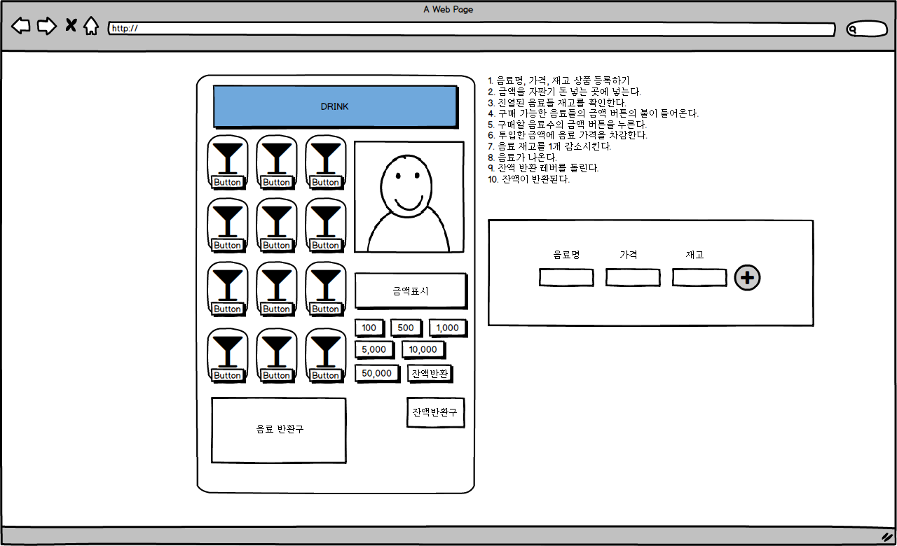

# [#B8B4F5]vendingMachine_2

  - 리액트로 다시 만들어보는 자판기

## 작업 환경

  - `create-react-app` 사용
  - `react15, react16`
  - `es6`

## 테마

  1. 금액를 넣으면 선택한 음료수가 나온다.

## 줄거리

  - 관리자
  1. 음료을 등록한다.

  - 사용자
  1. 금액를 넣는다.
  1. 음료를 선택한다.
  1. 금액가 결제된다.
  1. 음료가 나온다.
  1. 잔돈이 반환된다.

  *위와 같이 관리자, 사용자로 나눠야 하지만 이번 프로젝트에서는 나누지 않기로 했다.*

## 시나리오

  1. 음료명, 가격, 재고 음료 등록하기 - [음료등록]
  2. 등록된 음료 진열대에 진열하기- [음료진열]
  3. 금액을 자판기 돈 넣는 곳에 넣는다. - [결제-금액충전]
  4. 진열된 음료들 재고를 확인한다. - [결제-재고확인]
  5. 구매 가능한 음료들의 금액 버튼의 불이 들어온다.[결제-구매가능음료표시]
  6. 구매할 음료수의 금액 버튼을 누른다.[결제-구매버튼누름]
  7. 투입한 금액에 음료 가격을 차감한다.[결제-구매버튼누름]
  8. 음료 재고를 1개 감소시킨다.[결제-구매버튼누름]
  9. 음료가 나온다.[결제-구매버튼누름]
  10. 금액 반환 레버를 돌린다.[결제-반환버튼누름]
  11. 금액이 반환된다.[결제-반환버튼누름]

## Project 요구사항

1. 시작과 동시에 초기화를 실시하고 화면을 구성한다.
1. [음료등록] (분기) 중복된 이름의 음료라면, 등록 버튼을 눌렀을때 경고메세지를 보여준다.("중복된 음료가 존재합니다.)
2. [음료등록] (분기) 그렇지 않다면, 음료를 등록합니다.
3. [음료진열] (분기) 12개의 음료가 모두 진열되서 진열된 자리가 없을 경우, 진열 버튼을 눌렀을때 경고메세지를 보여준다.("진열할 공간이 없습니다.")
4. [음료진열] (분기) 그렇지 않다면, 음료를 진열대에 진열합니다.
5. [결제-금액충전] 해당 충전 금액 버튼을 누르면, 금액이 충전 후 금액을 표시한다.
6. [음료재고확인] (분기) 진열된 음료의 재고를 확인해 재고가 없는 음료들은 구매 버튼에 불빛이 들어오지 않게 한다.
7. [음료재고확인] (분기) 그렇지 않다면, 음료 구매 버튼에 불빛이 들어오게 한다.
8. [결제-금액확인] (분기) 재고가 충분하지만 충전 금액으로 살 수 없는 음료들은 버튼에 불빛이 들어오지 않게하고 사용불가 상태로 만든다.
9.  [결제-금액확인] (분기) 그렇지 않다면, 음료 구매 버튼에 불빛이 들어오게 한다.
10. [음료재고감소] 해당 음료 재고가 1개 감소한다.
11. [결제-음료계산] 충전 금액에서 음료 금액을 차감 후 금액 표시한다.
12. [음료반환] 음료 반환구로 음료수(이미지)가 나온다.
13. [금액반환] 금액반환버튼을 누른다.
14. [금액반환] 금액이 금액반환구로 나온다.

### 음료

1. 음료 등록
  - 소요시간 : 2시간
  - 완료조건 :
    ```
    1. [음료등록] (분기) 중복된 이름의 음료라면, 등록 버튼을 눌렀을때 경고메세지를 보여준다.("중복된 음료가 존재합니다.)
    2. [음료등록] (분기) 그렇지 않다면, 음료를 등록합니다.
    ```

2. 음료 진열
  - 소요시간 : 2시간
  - 완료조건 :
    ```
    1. [음료진열] (분기) 12개의 음료가 모두 진열되서 진열된 자리가 없을 경우, 진열 버튼을 눌렀을때 경고메세지를 보여준다.("진열할 공간이 없습니다.")
    2. [음료진열] (분기) 그렇지 않다면, 음료를 진열대에 진열합니다.
    ```

3. 음료 재고 확인
  - 소요시간 : 2시간
  - 완료조건 :
    ```
    1. [음료재고확인] (분기) 진열된 음료의 재고를 확인해 재고가 없는 음료들은 구매 버튼에 불빛이 들어오지 않게 한다.
    2. [음료재고확인] (분기) 그렇지 않다면, 음료 구매 버튼에 불빛이 들어오게 한다.
    ```

4. 음료 재고 감소
  - 소요시간 : 1시간
  - 완료조건 :
    ```
    1. [음료재고감소] 해당 음료 재고가 1개 감소한다.
    ```

5. 음료 반환
  - 소요시간 : 1시간
  - 완료조건 :
    ```
    1. [음료반환] 음료 반환구로 음료수(이미지)가 나온다.
    ```

### 결제

1. 금액 충전
  - 소요시간 : 2시간
  - 완료조건
    ```
    1. [결제-금액충전] 해당 충전 금액 버튼을 누르면, 금액이 충전 후 금액을 표시한다.
    ```
2. 금액 확인
  - 소요시간 : 2시간
  - 완료조건
    ```
    1. [결제-금액확인] (분기) 재고가 충분하지만 충전 금액으로 살 수 없는 음료들은 버튼에 불빛이 들어오지 않게하고 사용불가 상태로 만든다.
    2. [결제-금액확인] (분기) 그렇지 않다면, 음료 구매 버튼에 불빛이 들어오게 한다.
    ```
3. 금액 계산(음료 계산)
  - 소요시간 : 2시간
  - 완료조건
    ```
    1. [결제-음료계산] 충전 금액에서 음료 금액을 차감 후 금액 표시한다.
    ```

4. 금액 반환
  - 소요시간 : 2시간
  - 완료조건
    ```
    1. [금액반환] 금액반환버튼을 누른다.
    2. [금액반환] 금액이 금액반환구로 나온다.
    ```

## 화면정의서



## 구조 분석

  - VendingMachine - 자판기
    - `registerItem(item)` - 음료 등록
    - `displayItem(itemList)` - 음료 진열
    - `render()` - UI 그리기(진열하기)
    - `inputPayment(payment)` - 금액 충전
    - `checkStock(item)` - 재고 확인
    - `availableSale` - 판매 가능 음료 표시
    - `putItem(item)` - 음료 선택
      - `putPayment(item)` - 구매 금액 입력???
    - `exitSelectDrink(item)` - 음료 반환
    - `returnMoney()` - 금액 반환

    - 컴포넌트 분리
      - 자판기
        - 음료 등록
          - 등록 폼
        - 음료 진열 영역
          - 아이템 리스트
          - 아이템
        - 음료 반환 영역
          - 아이템 반환구
        - 금액 영역
          - 금액 충전
          - 금액 반환

## 순서도

- 전체 순서도

  1. 음료명, 가격, 재고 음료 등록하기 - [음료등록]
  2. 등록된 음료 진열대에 진열하기- [음료진열]
  3. 금액을 자판기 돈 넣는 곳에 넣는다. - [결제-금액충전]
  4. 진열된 음료들 재고를 확인한다. - [결제-재고확인]
  5. 구매 가능한 음료들의 금액 버튼의 불이 들어온다.[결제-구매가능음료표시]
  6. 구매할 음료수의 금액 버튼을 누른다.[결제-구매버튼누름]
  7. 투입한 금액에 음료 가격을 차감한다.[결제-구매버튼누름]
  8. 음료 재고를 1개 감소시킨다.[결제-구매버튼누름]
  9. 음료가 나온다.[결제-구매버튼누름]
  10. 금액 반환 레버를 돌린다.
  11. 금액이 반환된다.