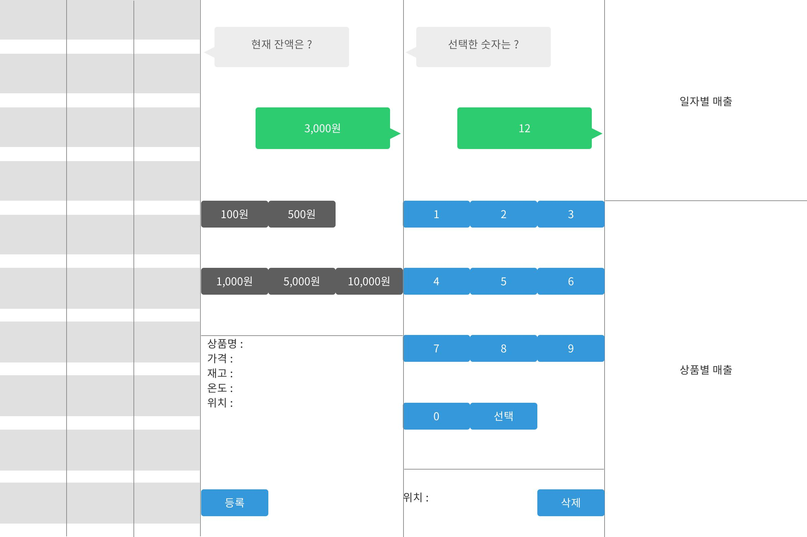
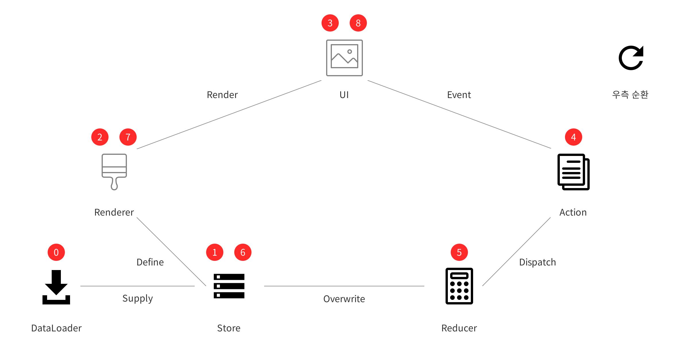

# [#5F4B8B] Vending Machine

## Project 요구사항

### 상품

재고 확인, 표시, 등록 등등 모두 자판기에서 사용되는 기능이지만 상품과 관련 된 상품의 카테고리로 묶어 정리

* 재고 확인

  1.  상품 채우기, 결제시마다 재고를 확인하여 작업을 진행해야 함

  * 기능 : 해당 상품의 재고를 확인하여 작업이 가능한지 회신
  * 완료조건
    * 채우기 시에 재고가 30 개가 넘지 않도록 한다
    * 결제 시에 재고가 -가 되지 않도록 한다
  * 소요시간 : 1 시간

* 재고 표시

  1.  상품의 변동사항에 따라 재고가 얼마인지에 대한 값을 반환

  * 기능 : 상품별 재고를 표시한다
  * 완료조건 : 상품별 재고가 변화할 때마다 화면에 수정된 값이 보여진다
  * 소요시간 : 1 시간

* 상품 등록

  1.  상품명, 가격, 재고량의 데이터를 가짐

  * 기능 : 상품을 추가할 수 있다
  * 완료조건 : 상품이 추가되고, 다른 상품들과 동일하게 동작한다
  * 소요시간 : 1 시간

* 상품 채우기

  1.  재고를 확인 할 수 있어야 함
  2.  재고의 MAX 값은 30 을 넘기지 않음
  3.  상품을 채우기 전에는 상품이 등록되어 있어야 함

  * 기능 : 상품의 재고를 추가할 수 있다
  * 완료조건
    * 없는 상품에 대해선 추가되지 않는다
    * 30 개를 초과할 수는 없다
  * 소요시간 : 1 시간

* 상품 빼기
  1.  재고와는 상관없이 상품을 뺄 수 있음
  2.  상품을 빼면 등록 된 상품 정보 또한 없어짐
  3.  상품을 빼기 전에는 상품이 등록되어 있어야 함
  * 기능 : 상품을 제거할 수 있다
  * 완료조건
    * 없는 상품에 대해서 제거할 수 없다
    * 제거하면 해당 상품에 대해 채우기, 선택이 불가
  * 소요시간 : 1 시간

### 자판기

* 상품 진열 공간

  1.  3 X 10 사이즈의 상품을 팔 수 있는 공간을 가짐
  2.  각각의 진열대에는 상품을 등록 혹은 뺄 수 있음
  3.  각각의 상품은 `ice` or `hot` 값을 가짐

  * 기능 : 상품을 보여줄 수 있다
  * 완료조건
    * 진열대에 상품이 보여진다
      * `ice`, `hot` 여부를 보여줄 수 있다
    * 상품을 새로 등록할 수 있다
    * 등록된 상품을 제거할 수 있다
  * 소요시간 : 1 시간

* 자판기의 상태

  1.  현재 상품의 판매가 가능한지 여부를 반환

  * 기능 : 자판기 사용 가능 여부를 표시할 수 있다
  * 완료조건
    * 자판기가 판매가능할 시, 해당 여부를 보여준다
    * 자판기가 판매불가할 시, 해당 여부를 보여준다
  * 소요시간 : 1 시간

* 상품 선택 버튼

  1.  입력받은 잔액이 상품의 가치보다 적을 때는 판매하지 못함

  * 기능 : 상품을 선택할 수 있다
  * 완료조건
    * 잔액이 해당 상품의 가치보다 클 때, 구매할 수 있다
    * 잔액이 해당 상품의 가치보다 작을 때, 구매할 수 없다
  * 소요시간 : 1 시간

* 판매량 체크

  1.  하루 동안 어떤 상품이 얼마나 팔렸는지 기록
  2.  하루 총 매출 기록
  3.  상품별 매출을 기록

  * 기능 : 일별 & 상품별 매출을 집계할 수 있다
  * 완료조건
    * 당일 실제로 팔린 금액과 집계 금액이 일치한다
    * 해당 상품이 실제로 팔린 금액과 집계 금액이 일치한다
  * 소요시간 : 1 시간

* 재화를 입력

  1.  동전, 지폐를 입력 받음

  * 기능 : 동전과 지폐를 통해 잔액을 증가시킬 수 있다
  * 완료조건
    * 동전을 입력받을 수 있고 해당하는 가치만큼 잔액이 증가한다
    * 지폐를 입력받을 수 있고 해당하는 가치만큼 잔액이 증가한다
  * 소요시간 : 1 시간

* 결제

  1.  상품 선택 버튼이 눌려지면 상품 1 개 값을 잔액에서 차감
  2.  상품 1 개를 반환

  * 기능 : 상품을 선택하여 구매할 수 있다
  * 완료조건
    * 상품을 선택하면 잔액이 차감된다
    * 상품을 선택하면 재고가 줄어든다
    * 상품을 선택하면 상품을 받을 수 있다
  * 소요시간 : 1 시간

* 잔돈을 반환
  1.  상품이 결제가 끝나면 5 초 후 남은 재화를 반환
  2.  결제 후 5 초 전에 다른 상품을 결제를 하면 다시 5 초로 리셋
  * 기능 : 상품 결제 후 5 초 동안 동작이 없다면 잔액이 반환된다
  * 완료조건
    * 상품을 결제한 후 5 초 후에 잔액이 자동으로 반환된다
    * 상품을 결제한 후 5 초 안에 다른 상품을 선택하면 반환타이머가 5 초로 초기화된다
  * 소요시간 : 1 시간

## 화면정의서

## 순서도

## Milestone

### 1 주

* Logic
  * 재고 확인
  * 재고 표시
  * 상품 등록
  * 상품 채우기
  * 상품 빼기
  * 판매량 체크
  * 결제
  * 상품 진열 공간(Logic)
  * 자판기의 상태(Logic)
  * 상품 선택 버튼(Logic)
  * 재화를 입력(Logic)
  * 잔돈을 반환(Logic)

### 2 주

* UI
  * 상품 진열 공간(Front)
  * 자판기의 상태(Front)
  * 상품 선택 버튼(Front)
  * 재화를 입력(Front)
  * 잔돈을 반환(Front)

## 일정산출

### 목요일(4/5)

* 순서도 작성
* 화면정의

### 금요일(4/6)

* 프로젝트 스펙 결정 및 세팅
* TDD

### 토요일(4/7)

* TDD

### 일요일(4/8)

* TDD

### 월요일(4/9)

* TDD

### 화요일(4/10)

* 미팅에서의 피드백 반영
* HTML 학습/구현

### 수요일(4/11)

* HTML 학습/구현

### 목요일(4/12)

* CSS 학습/구현

### 금요일(4/13)

* CSS 학습/구현

### 토요일(4/14)

* CSS 학습/구현

### 일요일(4/15)

* JavaScript Binding

### 월요일(4/16)

* 마무리 정리
